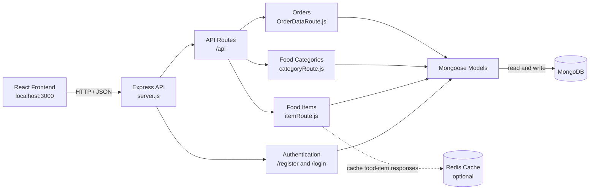

# Food Delivery Backend

This folder contains the Express and MongoDB API for the food delivery application.

## Requirements

- Node.js 18 or newer
- MongoDB connection string
- Redis connection string (optional)

## Setup

From this folder, install the dependencies:

```bash
npm install
```

Create a `.env` file in the `backend` folder:

```env
MONGO_URL=mongodb://127.0.0.1:27017/food_delivery
PORT=10000
REDIS_URL=redis://localhost:6379
```

`MONGO_URL` is required for database operations. Redis is optional; when `REDIS_URL` is missing or unavailable, the API continues without caching.

## Running the API

Start the server with:

```bash
npm start
```

The API is available at `http://localhost:10000` unless a different `PORT` is configured.

## Architecture



The frontend sends HTTP requests to the Express API. Route modules validate requests and use the Mongoose models to read from or write to MongoDB. Food item responses may be served from Redis when it is configured and available; Redis failures do not stop the API.

## API Endpoints

### Authentication

| Method | Endpoint | Description |
| --- | --- | --- |
| `GET` | `/` | API welcome response |
| `POST` | `/register` | Register a user |
| `POST` | `/login` | Authenticate a user and receive a token |

### Food and Categories

| Method | Endpoint | Description |
| --- | --- | --- |
| `GET` | `/api/food-items` | List food items |
| `GET` | `/api/food-categories` | List food categories |

`/api/food-items` supports pagination and field selection:

```text
/api/food-items?page=1&limit=20&fields=name,price,image
```

### Orders

| Method | Endpoint | Description |
| --- | --- | --- |
| `POST` | `/api/orderData` | Save an order for an email address |
| `POST` | `/api/myOrderData` | Retrieve order history for an email address |

## Project Structure

```text
backend/
├── models/                 # Mongoose schemas
├── Routes/                 # Food, category, and order routes
├── redisClient.js          # Optional Redis cache adapter
├── server.js               # Express application entry point
└── package.json
```

## Notes

- CORS currently allows the local frontend at `http://localhost:3000` and the deployed frontend configured in `server.js`.
- Passwords are hashed with `bcryptjs`.
- The API returns a JWT from `/login` for client authentication.